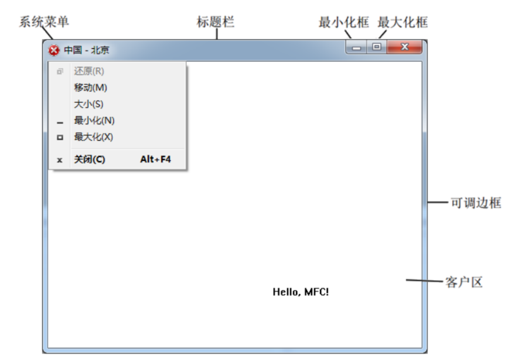
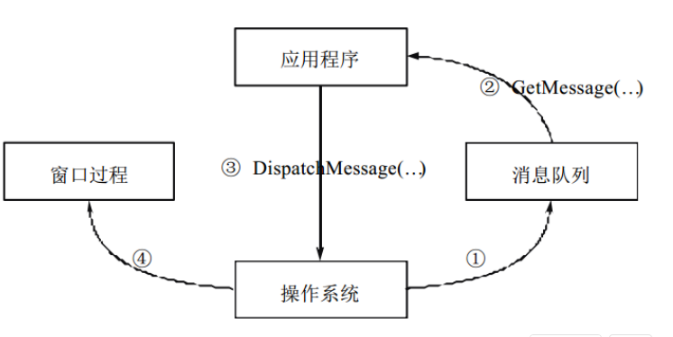

# MFC基础知识

MFC应用程序通常包含标题栏、菜单栏、系统菜单、最小化框、最大化框、可调边框、滚动条，客户区等。



sdk api 句柄

- 图标句柄：HICON
- 光标句柄：HCURSOR
- 画刷句柄: HBRUSH

windows 消息处理机制



windows 系统头文件: window.h, 程序入口: winMain

## 底层创建窗口

1. 设计窗口 WNDCLASS wc 
2. 注册窗口 RegisterClass
3. 创建窗口 createWindow
4. 显示和更新 showWindow  updateWindow
5. 通过循环取消息  MSG msg  
5.1. 写循环 while（1）  
5.2. GetMessage == false 退出循环   
5.3. 翻译消息  
5.4. 分发消息  
6. 窗口过程  
6.1. LRESULT CALLBACK WindowProc  
6.2. 返回默认处理  
6.3. return DefWindowProc(hwnd, uMsg, wParam, lParam);  
6.4. 点击叉子 WM_CLOSE  destroy  
6.5. WM_DESTROY  postQuitMessage（0）  
6.6. 鼠标左键按下  
6.7. 键盘按下  
6.8. 绘图 文字  

```

```

## MFC创建窗口

1. mfc头文件 afxwin.h
2. 自定义类 继承与 CWinApp  应用程序类  MyApp app 应用程序对象 ，有且仅有一个
3. 程序如果  InitInstance
4. 入口里 创建窗口
5. 窗口类 MyFrame 继承与 CFrameWnd 
6. MyFrame 构造中 Create（NULL，标题名称）
7. 创建窗口对象 
8. 显示和更新
9. m_pMainWnd = frame; //保存指向应用程序的主窗口的指针
10. return TRUE
11. 对项目进行配置  在共享DLL中使用MFC

### 消息映射
1. 声明宏  写到.h中 
2. 分界宏 写到.cpp中
3. 找消息宏  写到 分界宏 中间
4. 把函数原型 声明写到.h中
5. 函数的实现写到.cpp中
6. 鼠标、键盘、绘图

### window字符集

1. 多字节 字符串 转宽字节 L
2. 声明 宽字节字符创 wchar_t 
3. 统计宽字节字符串 wcslen
4. TEXT 做了自适应编码转换
5. char*  CString之间转换

### 利用向导创建mfc
1. view视类  相片  MainFram类 相框
2. OnCreate  Create  WM_Create 联系
3. OnDraw OnPaint 如果同时存在 OPaint会覆盖OnDraw

# 对话框与控件

# 综合案例
